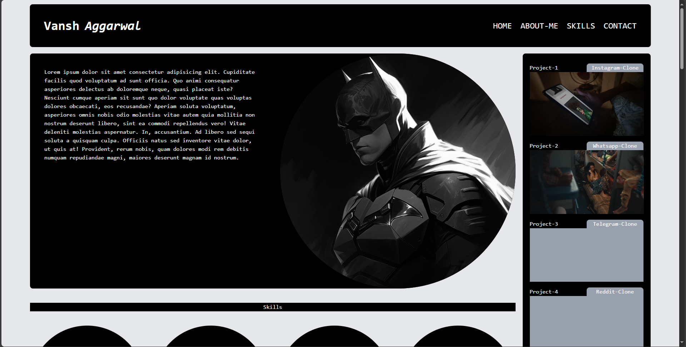
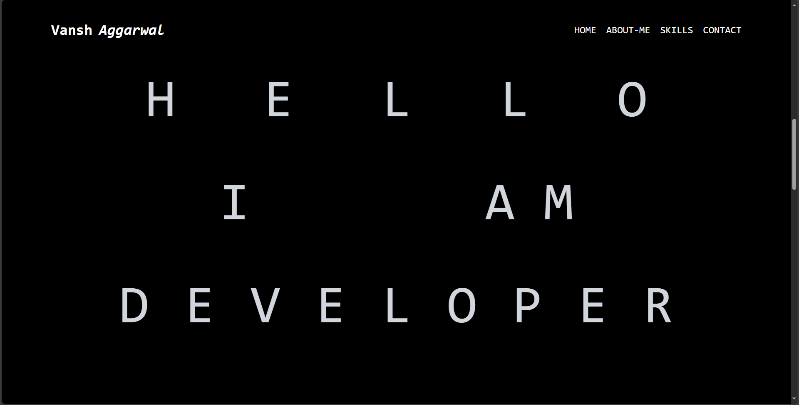
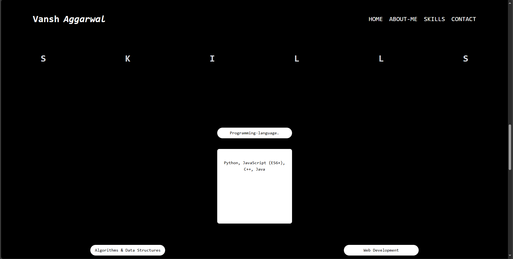
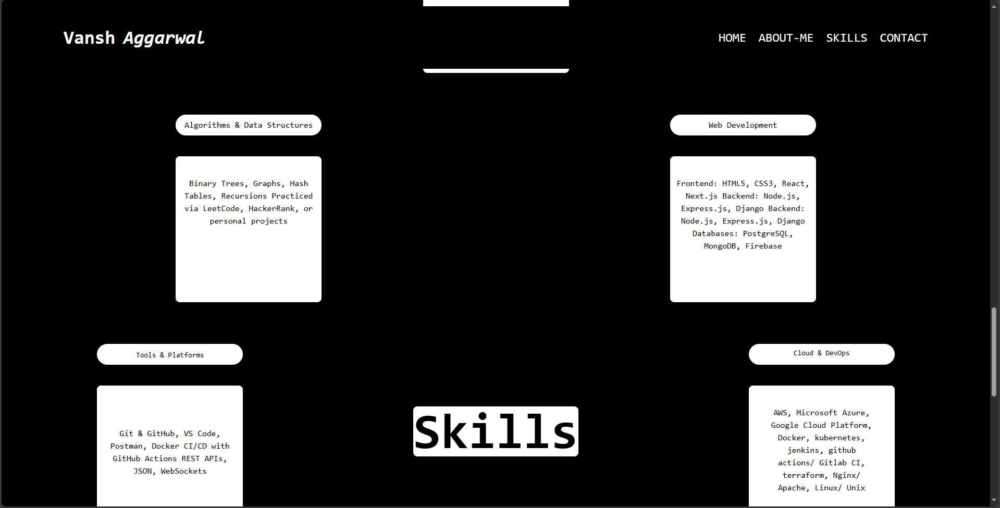
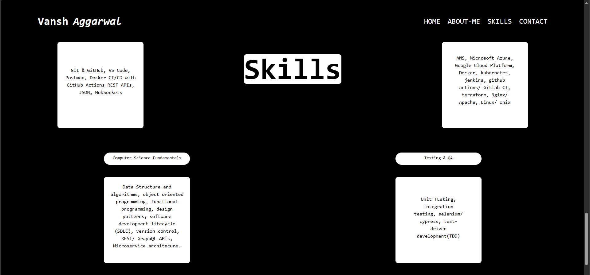
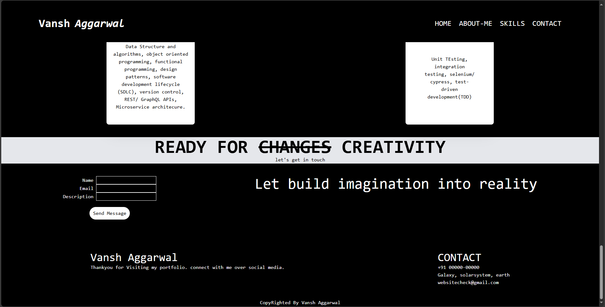

# tailwindcss-portfolio-practice

hi, i am vansh aggarwal.
i just make the portfolio using html , and tailwind css.

# Rist Page of Website

# Second Page of Website

# third page of Website

# fourth page of website

# five page of website

# sixth page of website

